# Agentic Cyber

The root `CLAUDE.md` has information about hacking methodology and different guidelines. Also, there are some custom skills loaded into the project and dedicated agents.

## Requirements

Install this CLI tools in the host, also note that the locations given to the agents to look for Wordlists are `/usr/share/seclists` and `/home/kali/Wordlists`:

```
playwright-cli
shodan
subfinder
crt
nmap
httpx
ffuf
katana
```

In addition to the CLI tools, install the `superpowers` skill and these skills from `trailofbits/skills-curated` marketplace:
```
ffuf-web-fuzzing
ghidra-headless
humanizer
security-awareness
openai-playwright
```

## scope-recon agent

During the reconnaissance phase, launch this agent first: "Run scope-recon for Acme Corp, subsidiaries in scope". The agent will generate the file `state/scope.json`.

In case the scope is already known, provide a file to the agent and it will process it to generate `state/scope.json` from it.

## Scout pipeline

If the `state/scope.json` assets are indeed part of the assesment, run this pipeline, it is focussed on discovering the exposed perimeter of a company. It will produce a report with information about all the attack surface of the target to ease the reconnaissance phase.


