# Agentic Cyber

## General

Just a simple `CLAUDE.md` with information about hacking methodology and different guidelines. It is good enough for CTFs, HackTheBox or even real hacking if you are bave enough to one shot stuff.

## Attack Surface Discovery

This is an agentic pipeline focussed on discovering the exposed perimeter of a company. It will produce a report with information about all the attack surface of the target to ease the reconnaissance phase.

